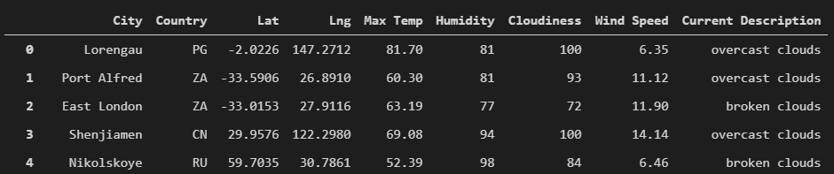
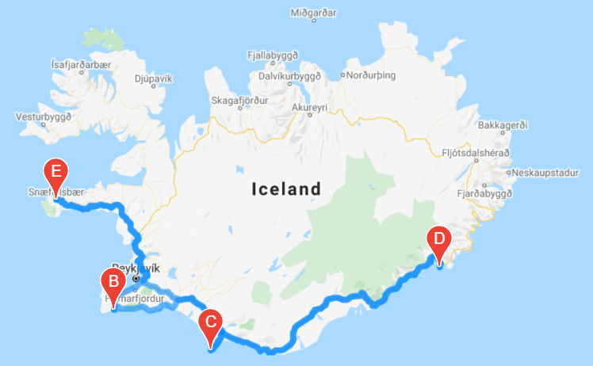
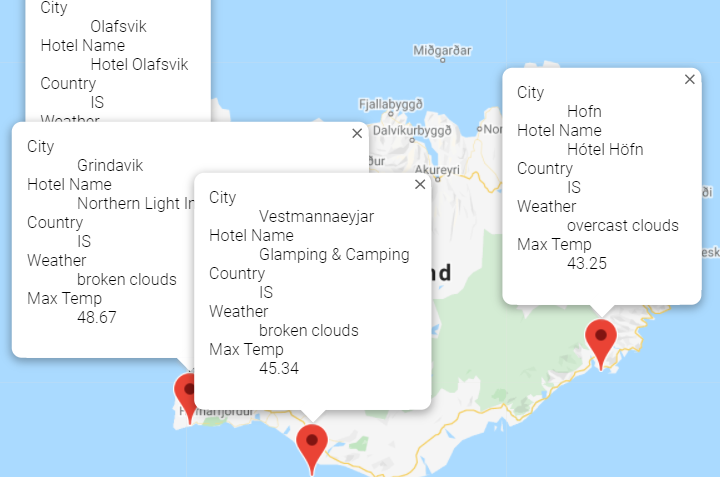

# World Weather 	Analysis

## Project Overview
The purpose of this analysis is to help create PlanMyTrip, an app that will take a users' vacation plans and weather preferences to generate a list of possible vacation   locations and to recommend the ideal hotel for the user. The app will also generate the best routes for different stops throughout the trip. To do this, we will use the OpenWeather and GoogleMaps API to create a DataFrame of possible vacation spots from around the world, grab their real time weather data, and filter the data according to the users' preferences.

## Resources
- APIs: 
	- OpenWeather
	- Google Maps overview
- Software: 
	- Python 3.7.10
	- Jupyter Notebook
	- Pandas Library
	- Matplotlib Library
	- NumPy Library
	- Gmaps Library

## Data and Results
The list of cities and their corresponding weather data are first collected and condensed into a single DataFrame:

Using the data from this DataFrame, we can filter out the relevant data according to the users' preferences. All of the cities chosen by the user are then placed on a map with markers holding relevant weather information and the best route for travel is shown as well.

